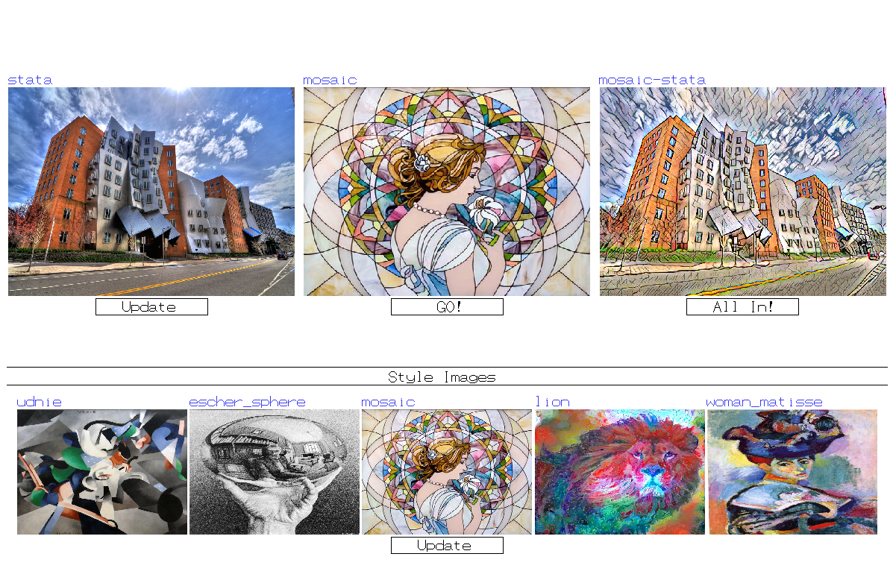

# App for Style Transfer

This app was built using the C++ UI framework which was designed for 
the course project of Advanced Engineering Computation (24-783). The UI framework was in turn built on top of an OpenGL cross-platform window framework **FsSimpleWindow** 
created at Carnegie Mellon University by Prof. Soji Yamakawa . The UI framework follows the following hierarchy. 

[Tensorflow implementation](https://github.com/elleryqueenhomels/arbitrary_style_transfer) of style transfer using adaptive instance normalisation was 
used as the [backend](dist/python_files/arbitrary_style_transfer) for transferring style. The app outputs an image inside the ui after transferring a style of an image onto 
a content image.
 
### Recommended Requirement
* Linux environment

The program has been tested on linux (Ubuntu-16.04) and was designed to be cross platform
(Windows and MacOS), it can be ported by replacing file reading capabilities of dirent.h which is 
included in [libraries](./src/framework/include/libraries.h) and the functions called in  [bmplocations](./src/framework/include/bmplocations.cpp)

### Other Requirements
* Python 3.5 environment, required libraries are present in requirements.txt (tensorflow model would be used to transfer style onto image)
* *cmake* and *make* capabilities (if you wish to build the app from source)

### Running the App
* Run [setup_script.sh](./dist/setup_script.sh) to download the data files (training checkpoint and vgg weights).
* Activate the python environment (in the terminal) after installing all the libraries listed in requirements.txt
* Run the [Style transfer executable](./dist/StyleTransferApp).

### Using the app:
* Use left and right arrow keys to change the style image and up and down arrow keys
to change the content image.
* The output image would be updated automatically, if the background is white then press **Go!** to transfer the style onto the content image. The tensorflow model would only be initialised if the output
image is not already present and you press **Go!**. 
* More style and content images can be added in the [images](./dist/images) directory. You can force the app to rebuild that hash that stores the location
of all images by pressing the **Update** button.
* If you wish to transfer style of all style images onto all content images, press **All In!**.

### Building the app from source:
* Make a build directory inside the current project. Inside the build directory, run *cmake* for the source files in [src](./src)
directory.
* Run *make*, the exectuable would be created at ./dist/StyleTransferApp ([here](./dist/StyleTransferApp)).

### User Interface

